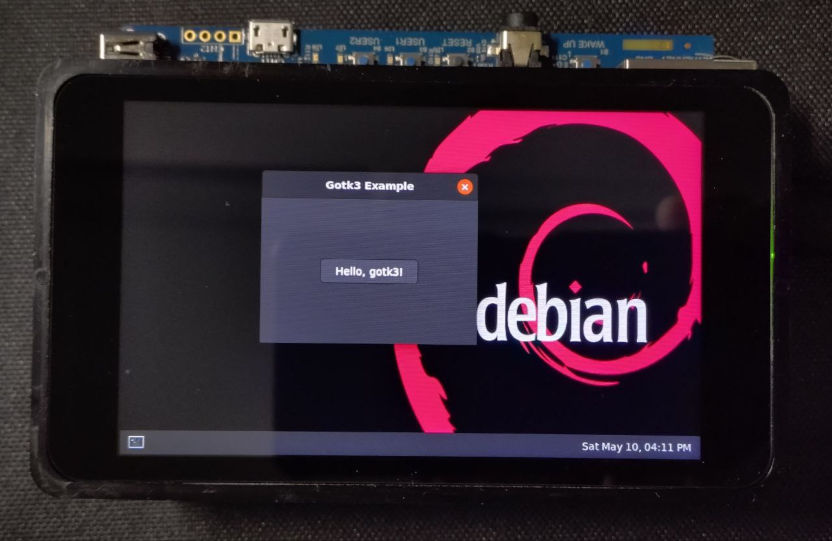

# STM32MP1 Debian Linux recipes

Tested on the `STM32MP157F DK2` and `STM32MP157C ODYSSEY` platforms.  
Based on the Robert Nelson's (beagleboard.org) Debian minimal rootfs [builds](https://rcn-ee.com/rootfs/eewiki/minfs/).  
Debian [logo](https://github.com/shriramters/wallpapers) by Shriram Ravindranathan.

## Recipe list
* Debian Minimal (Secure Boot with OP-TEE) build [recipe](./STM32MP157F-DK2-DEBIAN-MINIMAL-OPTEE.md).
* Wi-Fi configuration [guide](./STM32MP157F-DK2-WIFI-DEBIAN.md).
* Weston Debian configuration [guide](./STM32MP157F-DK2-WESTON-DEBIAN.md).
* Debug M4 core in Production Mode with STM32CubeIDE on Debian [guide](./STM32MP157F-DK2-M4-DEBUG-DEBIAN.md).
* Go GTK3 [example](./gotk3-example/README.md).
